# АРМ врача v.4 от Leybasoft™

Этот репозиторий со "старой версией" программы "ARMDoc" v.4x

v.4.5.192
- на 90% переработан основной код программы
- ускорены получение, обработка и сохранение данных 
- "осовременен" интерфейс
- переработаны шаблоны отчетов
- добавлена возможность изменения некоторых настроек программы
- добавлена онлайн-справка (с обновлениями)
- программа распространяется в виде zip-архива (без инсталлятора)
- из программных требований:
	- win 7 и выше
	- Firebird 3 и выше

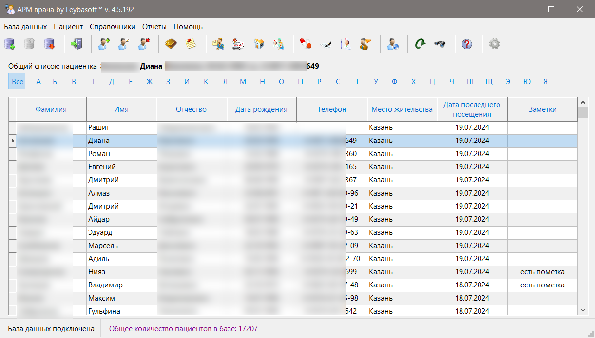

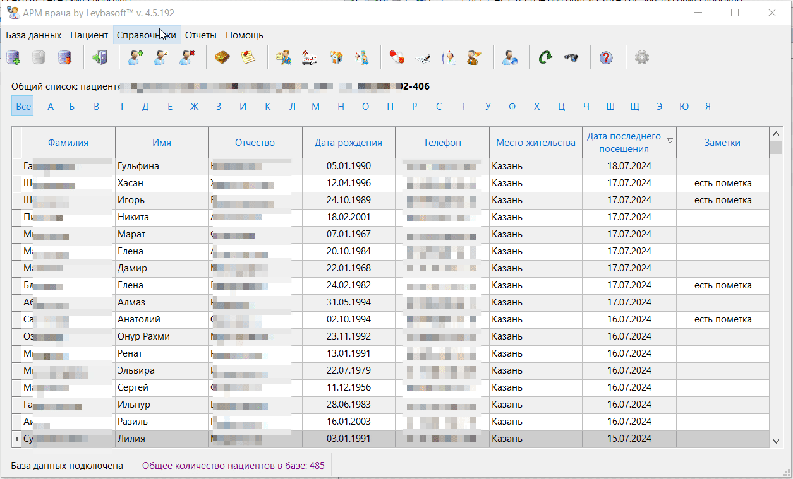

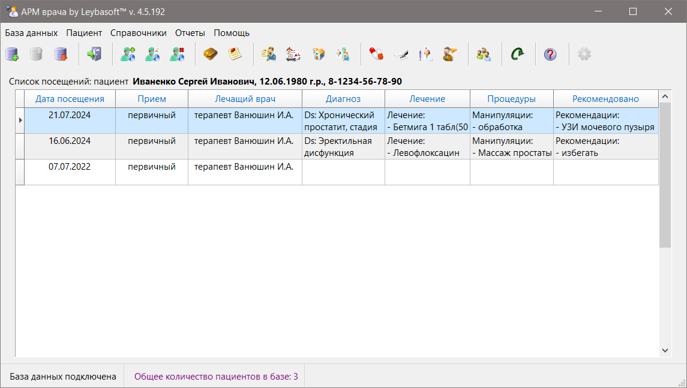

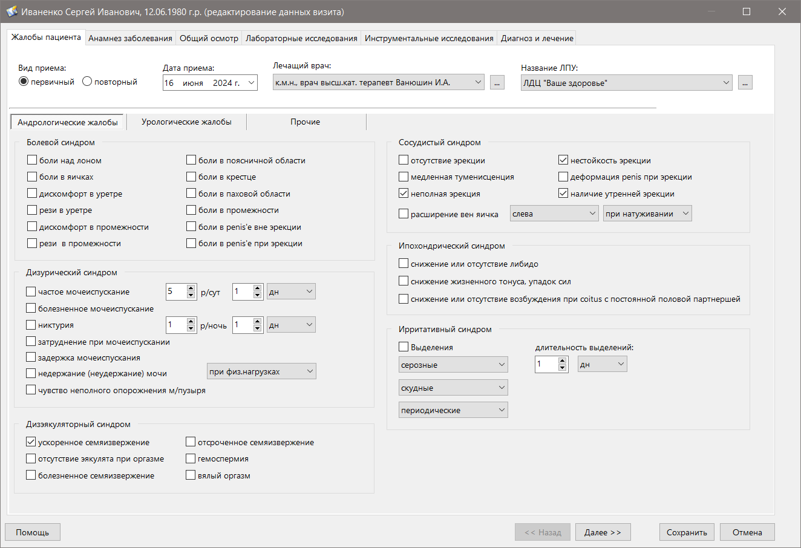

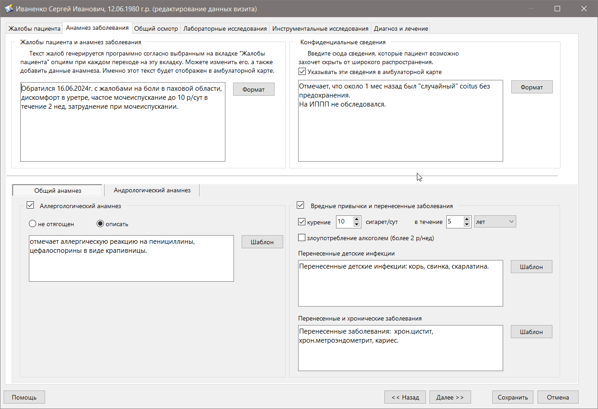

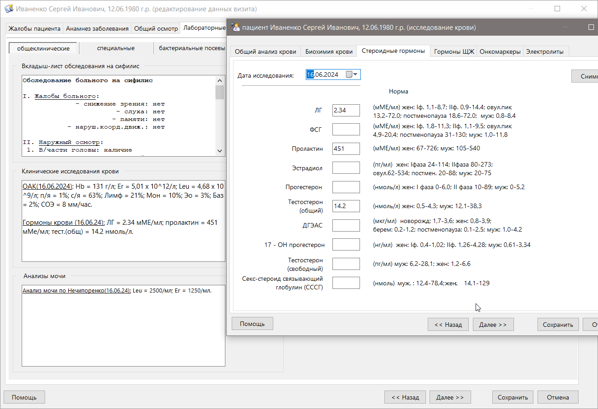

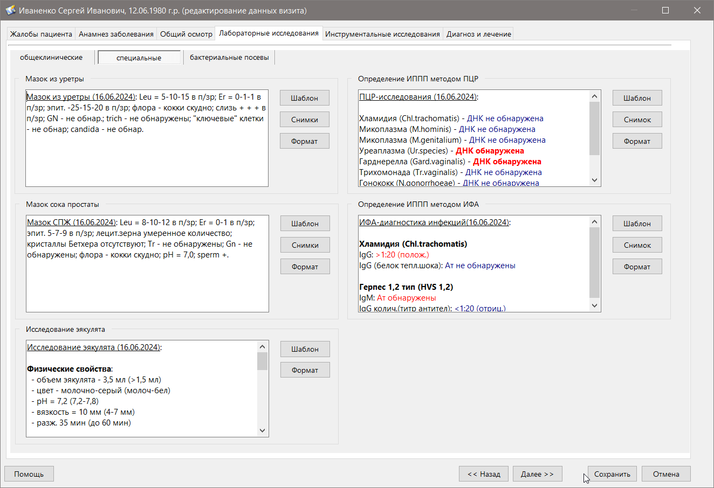

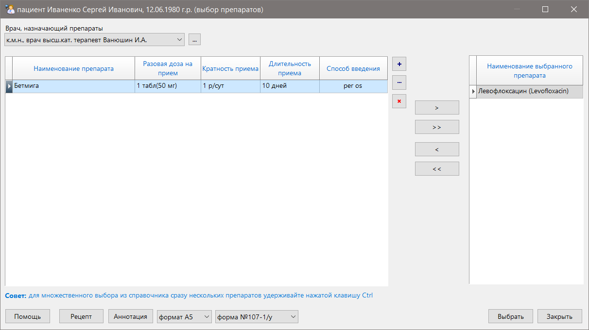

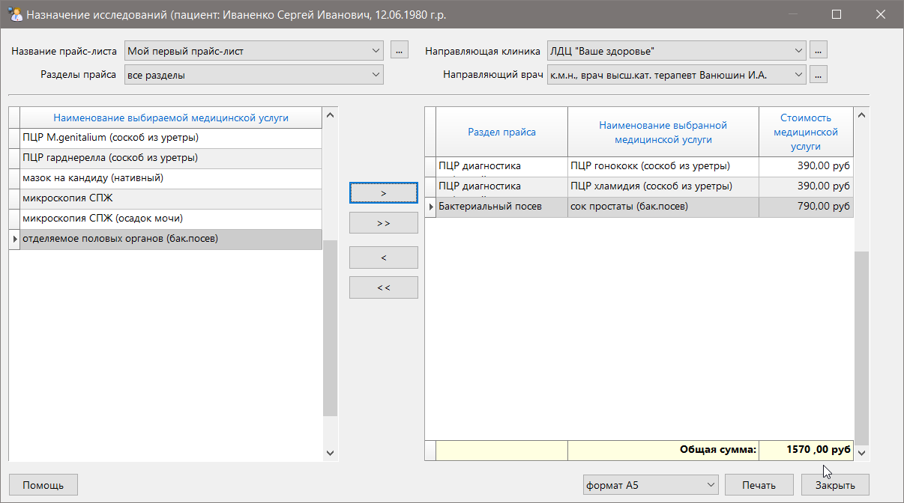

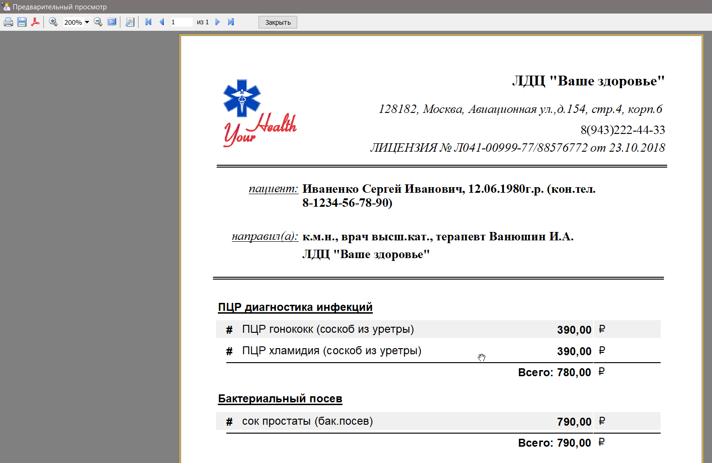

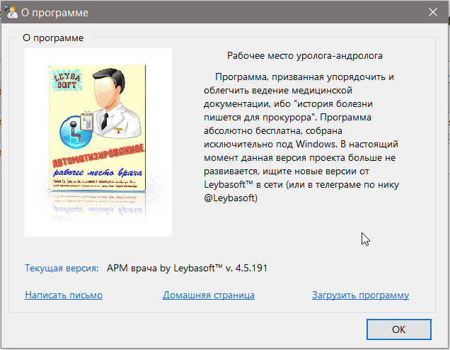

*По всем возникающим вопросам можно обращаться в телеграм-аккаунт [@Leybasoft](https://t.me/Leybasoft)* 

[Скачать](https://github.com/zoltanleo/ARM_doc_v4/releases) последнюю версию приложения

[Справка](https://zoltanleo.github.io/ARM_doc_v4_wiki/)  приложения

