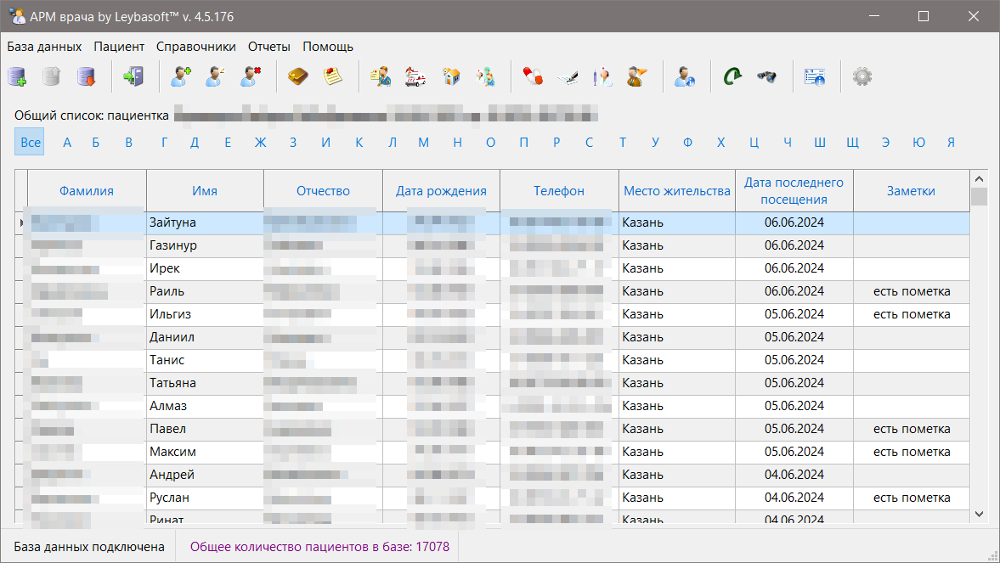
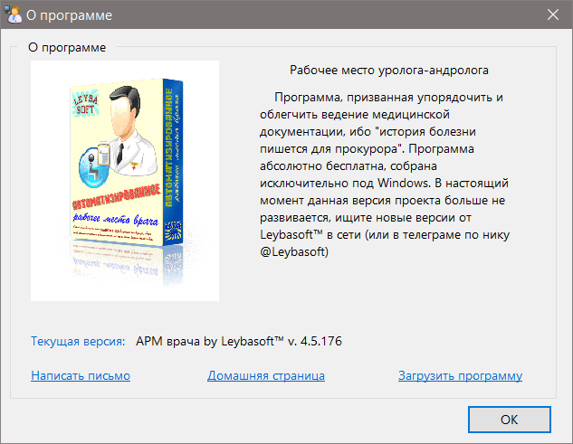

# АРМ врача v.4 от Leybasoft™

Этот репозиторий со "старой версией" программы "ARMDoc" v.4x

v.4.5.176
- на 90% переработан основной код программы
- ускорены получение, обработка и сохранение данных 
- "осовременен" интерфейс
- переработаны шаблоны отчетов
- добавлена возможность изменения некоторых настроек программы
- добавлена онлайн-справка (с обновлениями)
- программа распространяется в виде zip-архива (без инсталлятора)

*По всем возникающим вопросам можно обращаться в телеграм-аккаунт [@Leybasoft](https://t.me/Leybasoft)* 

[Скачать](https://github.com/zoltanleo/ARM_doc_v4/releases) последнюю версию приложения
Почитать [справку](https://github.com/zoltanleo/ARM_doc_v4/wiki)

===============================

v.4.3.23
- изменена папка для хранения временных файлов и файлов отчетов на \%USERPROFILE%\AppData\Local\arm_doc

v.4.3.22

- добавлена возможность увеличения картинок на весь экран в некоторых формах
- удалены некоторые bak-файлы форм и модулей

v.4.3.21

- передача сообщений из доп.потока в основной переделана с SendMessage/PostMessage на более корректные и потокобезоспасные Synchronize/Queue 

v.4.3.20

- добавлено автоскроллирование изображений (бланки и результаты исследований и т.д.)
- убрано ограничение в 500 kB загружаемых изображений

v.4.3.19

- окно коннекта имеет два режима отображения: для коннекта к полноценному серверу и встроенному
- пароль теперь не обрезается до 8 символов, как раньше, а передается на сервер полностью  

v.4.3.18

- поправлен баг GIU (выровнена вправо табличка с расписанием приемов врача)
- добавлена возможность вводить регистроЗАВИСИМЫЙ пароль

v.4.3.17

- компонент отчета и фильтры сделаны глобальными для всех отчетов в формах
- для каждого отчета имя экспортируемого файла уникально в пределах пациента
- в наборы данных для отчетов добавлены новые поля для имен отчетов
- отчеты по умолчанию сохраняются в папке %USERPROFILE%\Temp
- исправлена возможность добавлять пробелы в названия населенных пунктов

v.4.3.16
- руссифицирован FastReport
- оставлены форматы экспорта: *.html, *.odt, *.rtf, *.pdf
- имя экспортируемого файла состояит из имени_даты рождения_даты приема пациента

v.4.3.15
- исправлен мелкий баг с пустой ошибкой при коннекте, если класс ошибки не принадлежал к EFIBError

v.4.3.14
- исправлены некоторые опции датасетов (poFetchAll и др.), которые замедляли скорость чтения из базы

v.4.3.13
- фикс: баг с "невнятным" сообщением при добавлении 2-го визита с той же датой
- фикс: вывод сообщения ошибки при добавлении спермограммы производится не в секции finally, а в except + будет выведен "системный" текст ошибки EFIBError.Message

v.4.3.12
- фикс: ID текущего пациента при выборке визитов не соответствовал выбранному
- фикс: баг с необновлением детального грида при первом открытии

v.4.3.11
- исправлены фризы сплэша при сохранении добавленных или отредактированных данных визитов

v.4.3.10
- пофикшены мелкие баги с шоткатами в детальном гриде при создании и редактировании данных визита
- убраны лаги при обновлении детального грида

v.4.3.9
- "Долгоиграющие" запросы (открытие базы, таблицы визитов, редактирвоание данных визитов) перенесены в доп.поток с отображением сплэша 

v.4.3.8
- исправлена ошибка 'Canvas does not allow drawing' добавлением в код canvas.Lock/UnLock

v.4.3.7
- первое (некэшированное, а потому долгое) обращение к таблице визитов делается в доп.потоке

v.4.3.6

<<<<<<< HEAD
- коннект перенесен в доп.поток и реализуется внутри FrmConnect
=======
- коннект перенесен в доп.поток и реализуется внутри FrmConnect
>>>>>>> 964456096b0f34bdf00d4ebda29d519a7af820af
